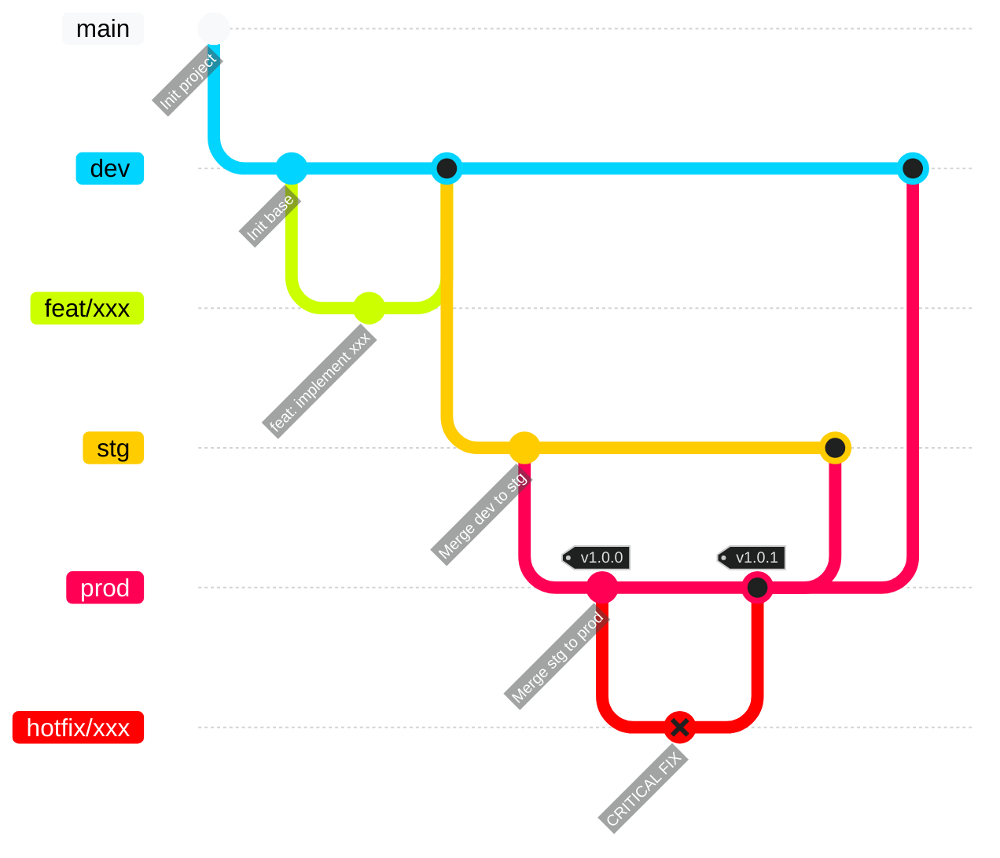
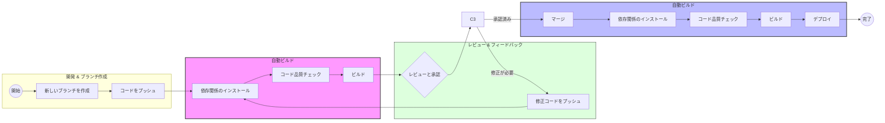
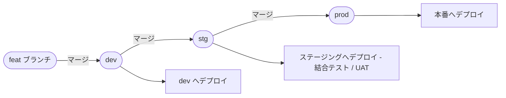

# Fitness CRM

フィットネス向けCRM（会員管理）Webアプリケーションです。

# 技術スタック

| カテゴリ       | 技術                      | 備考                                                                                 |
| :------------- | :------------------------ | :----------------------------------------------------------------------------------- |
| ランタイム     | Node.js                   | v24以上を推奨                                                                        |
| 言語           | TypeScript                | 全体にわたる型安全性の確保                                                           |
| フレームワーク | Next.js                   | App Routerを使用                                                                     |
| UIライブラリ   | shadcn/ui                 | Tailwind CSSベースのコンポーネント                                                   |
| リンター       | ESLint                    | コード品質の自動チェック                                                             |
| フォーマッター | Prettier                  | チーム全体での統一されたコードスタイル <br> インポートの自動整列                     |
| コミット管理   | husky <br /> lint-staged  | コミット時にLint/フォーマッターを自動実行                                            |
| 仕様駆動開発   | SpecKit（GitHub Copilot） | 機能ごとの `spec.md` / `plan.md` / `tasks.md` などをエージェントで生成（詳細は下記） |

# SpecKit（SDD）と仕様書の置き場

本リポジトリでは **Specification-Driven Development（SDD）** を採用し、[SpecKit](https://github.com/github/spec-kit) 相当のワークフローを **GitHub Copilot 用のエージェント定義**（`.github/agents/`・`.github/prompts/`）と **`.specify/`** のスクリプト／テンプレートで運用します。`npm` パッケージとして SpecKit を追加インストールする必要はありません（リポジトリに同梱された定義を Copilot が読みます）。

## セットアップ（利用側）

1. 本リポジトリへのアクセスと、組織方針に従った **GitHub Copilot** の有効化。
2. 開発環境は通常どおり [インストール](#インストール)（`npm install` など）。
3. 機能開発を始める際は、Copilot の **エージェント／チャット**から `speckit.specify` などの SpecKit 系エージェントを起動し、自然言語の機能説明を渡します（具体的な呼び出し方法は利用中の Copilot UI に依存します）。

## 生成物の保存場所（レビュー時の目安）

**このプロジェクトで仕様・計画・タスクの正とするパスは次です。**

| 種類                         | パス（機能名は例）                                          |
| :--------------------------- | :---------------------------------------------------------- |
| 機能仕様                     | `docs/specs/<feature>/spec.md`                              |
| 実装計画                     | `docs/specs/<feature>/plan.md`                              |
| タスク一覧                   | `docs/specs/<feature>/tasks.md`                             |
| 調査・データモデル・契約など | `docs/specs/<feature>/research.md` など同一ディレクトリ配下 |

プロトタイプやフロー画面の素材も、同じ `docs/specs/<feature>/` 配下に置く運用です（詳細は [sdd-flow/sdd-dev-workflow.md](./sdd-flow/sdd-dev-workflow.md)）。

## フロー文書（手順の全体像）

| 文書                                                             | 内容                                                                                  |
| :--------------------------------------------------------------- | :------------------------------------------------------------------------------------ |
| [sdd-flow/sdd-overview.md](./sdd-flow/sdd-overview.md)           | SDD を採用する理由と前提                                                              |
| [sdd-flow/sdd-dev-workflow.md](./sdd-flow/sdd-dev-workflow.md)   | フェーズごとの作業手順（kickoff → specify → plan → tasks → analyze → implement など） |
| [sdd-flow/sdd-team-protocol.md](./sdd-flow/sdd-team-protocol.md) | レイヤー構成・コンテキスト注入・更新ルール（ツール非依存）                            |

# はじめに

## インストール

```bash
npm install
```

`npm install` 実行時に husky（Gitフック）も自動的にセットアップされます。

## 環境変数の設定

サンプルの環境ファイルをコピーし、必要に応じて値を更新してください：

```bash
cp .env.example .env
```

## 開発サーバーの起動

```bash
npm run dev
```

起動後、[http://localhost:3000](http://localhost:3000) にアクセスしてください。

## テスト用アカウント

| メールアドレス      | パスワード  |
| ------------------- | ----------- |
| admin@example.com   | password123 |
| staff@example.com   | password123 |
| manager@example.com | password123 |

## リンター / フォーマッター

リンターとフォーマッターはコミット時に自動実行されます。
プロジェクト全体に手動で適用する場合は、必要に応じて以下のコマンドを実行してください。
プロジェクトインストール時に生成されたデフォルト設定（eslint-config-next/core-web-vitals）を使用しています。

- ESLint
  - 設定ファイル：[eslint.config.mjs](./eslint.config.mjs)
  - 手動実行：`npm run lint`
- Prettier
  - 設定ファイル：[prettier.config.mjs](./prettier.config.mjs)
  - 手動実行：`npm run format`

# コードベース概要

## 1. フォルダ構成

```text
src/
├── app/                          # 【ルーティング & ドメインロジック】
│   ├── (public)/                 # パブリックアクセス（ログイン、登録、パスワードリセット）
│   ├── (shared)/                 # 共通ルート（ホーム、アバウト）
│   ├── (private)/                # 認証が必要なルート（ダッシュボード、プロフィール）
│   │   └── (dashboard)/          # メインアプリケーションシェル
│   │       ├── customers/        # 顧客ドメイン
│   │       │   ├── _components/  # ローカルUI（CustomerTable、CustomerModal）
│   │       │   ├── _hooks/       # ローカルロジック（useCustomerSort、useStats）
│   │       │   ├── _types/       # ローカルビューモデル / インターフェース
│   │       │   ├── actions.ts    # サーバーアクション
│   │       │   └── page.tsx      # /customers のエントリポイント
│   │       └── training/         # トレーニングドメイン
│   │           ├── _components/
│   │           └── page.tsx
│   ├── layout.tsx                # グローバルルートレイアウト
│   └── error.tsx                 # グローバルエラーバウンダリ
├── components/                   # 【共通UIコンポーネント】
│   ├── ui/                       # プリミティブパーツ（@heroui/react）
│   └── layout/                   # グローバル構造（サイドバー、ナビゲーションバー）
├── configs/                      # 【外部ライブラリ設定】
├── constants/                    # 【グローバル定数】
├── hooks/                        # 【グローバル共通フック】
├── lib/                          # 【コアライブラリ & 自動生成】
│   ├── api/                      # @hey-api によって生成
│   ├── routes/                   # 型安全なナビゲーション
│   └── utils.ts                  # ヘルパー関数
├── providers/                    # 【コンテキスト & 状態注入】
├── services/                     # 【サービスレイヤー】
├── stores/                       # 【グローバル状態管理】
├── styles/                       # 【スタイリング】（TailwindCSS v4）
├── types/                        # 【グローバル共通型】
└── utils/                        # 【ヘルパー関数】
```

## 2. 動作モード

- **`npm run dev`**：ルート自動生成とファイル監視を有効にした開発モードで起動
- **`npm run build`**：アプリケーションのビルド（ルート自動生成を含む）
- **`npm run start`**：本番サーバーの起動
- **`npm run generate-routes`**：ルート設定を手動で生成
- **`npm run generate-api`**：バックエンドの OpenAPI スペックから API クライアントを生成
- **`npm run generate-client`**：リモート API エンドポイントから API クライアントを生成

## 3. OpenAPI

- まず、使用している `hey-api` ライブラリに慣れてください（[ドキュメント](https://heyapi.dev/openapi-ts/get-started)）。

- `hey-api` から API 定義ファイルを生成する方法は2つあります：
  - **`npm run generate-api`** コマンドを使用：バックエンドサーバーに接続して `openapi.json` ファイルを取得します。
  - **`npm run generate-client`** コマンドを使用：事前に **`openapi.json`** ファイルを **`src/lib/`** に保存しておく必要があります。このコマンドは `openapi.json` 内のスキーマを元に API 定義ファイルを生成します。

- 使用例：

```ts
const { data, error } = useQuery({
  ...getPetByIdOptions({
    path: {
      petId: 1,
    },
  }),
});

const { data, error } = useInfiniteQuery({
  ...getFooInfiniteOptions({
    path: {
      fooId: 1,
    },
  }),
  getNextPageParam: (lastPage, pages) => lastPage.nextCursor,
  initialPageParam: 0,
});

const addPet = useMutation({
  ...addPetMutation(),
});

addPet.mutate({
  body: {
    name: 'Kitty',
  },
});
```

## 4. ルート自動生成

このプロジェクトでは、アプリディレクトリをスキャンして型安全なルート設定を自動生成するシステムを採用しています。手動でのルート定義が不要になり、TypeScript の完全なサポートが提供されます。

### 機能

- **型安全なナビゲーション**：IntelliSense によるコンパイル時チェック
- **自動検出**：アプリディレクトリ内のページを自動検出
- **ルートグループ対応**：Next.js のルートグループ `(public)`、`(private)`、`(shared)` をサポート
- **動的ルート対応**：静的・動的・キャッチオールルートに対応
- **開発時の監視**：ページの追加・削除時にルートを自動再生成

### ルートグループ

- **`(public)`**：認証なしでアクセス可能なパブリックルート
- **`(private)`**：認証が必要なプライベートルート
- **`(shared)`**：認証状態に関わらずアクセス可能な共通ルート

### 使用例

```typescript
import { isPrivateRoute, navigate } from '@/lib/routes/routes.util';

// 型安全なナビゲーション
const profileUrl = navigate('/profile'); // '/profile'
const isPrivate = isPrivateRoute('/profile'); // true
```

### 生成ファイル

システムは `src/lib/routes/` に3つのファイルを生成します：

- `routes.config.ts`：ルート設定オブジェクト
- `routes.type.ts`：TypeScript 型定義
- `routes.util.ts`：ナビゲーション用ユーティリティ関数

> 📖 **詳細ドキュメント**：完全な使用ガイドと API リファレンスは [ルートジェネレーター README](src/lib/routes/README.md) を参照してください。

## 5. 新規ページの追加方法

ルート自動生成システムにより、新規ページの作成が簡略化されています。適切なルートグループディレクトリにページファイルを作成するだけで、ルートが自動的に生成されます。

### ルートグループ構成

- **`(public)`**：公開ページ（ログイン、サインアップ、ランディングページ）
- **`(private)`**：認証済みユーザー向けページ（ダッシュボード、プロフィール、設定）
- **`(shared)`**：認証状態に関わらずアクセス可能なページ（ホーム、アバウト）

### 新規ページの作成手順

1. **認証要件に応じて適切なルートグループを選択**：
   - パブリックルート → `src/app/(public)/`
   - プライベートルート → `src/app/(private)/`
   - 共通ルート → `src/app/(shared)/`

2. **Next.js の規約に従ってページディレクトリとファイルを作成**：

   ```bash
   # プライベートなユーザープロフィールページの場合
   mkdir -p src/app/\(private\)/profile
   touch src/app/\(private\)/profile/page.tsx

   # パブリックなログインページの場合
   mkdir -p src/app/\(public\)/login
   touch src/app/\(public\)/login/page.tsx
   ```

3. **ページコンポーネントを実装**：

   ```tsx
   // src/app/(private)/profile/page.tsx
   export default function ProfilePage() {
     return (
       <div>
         <h1>プロフィールページ</h1>
         {/* ページのコンテンツ */}
       </div>
     );
   }
   ```

4. **ルートは自動的に生成されます** — 新規ページが検出され、以下のファイルが更新されます：
   - `src/lib/routes/routes.config.ts`
   - `src/lib/routes/routes.type.ts`
   - `src/lib/routes/routes.util.ts`

### 動的ルート

Next.js の標準パターンを使って動的ルートを作成します：

```bash
# 動的ルート：/users/[id]
mkdir -p src/app/\(private\)/users/[id]
touch src/app/\(private\)/users/[id]/page.tsx

# キャッチオールルート：/blog/[...slug]
mkdir -p src/app/\(shared\)/blog/[...slug]
touch src/app/\(shared\)/blog/[...slug]/page.tsx
```

### ナビゲーション

プログラムによるナビゲーションには、型安全な `navigate` 関数を使用してください：

```typescript
import { navigate } from '@/lib/routes/routes.util';

// 静的ルート
const homeUrl = navigate('/'); // '/'

// パラメーター付き動的ルート
const userUrl = navigate('/users/[id]', '123'); // '/users/123'

// Next.js の Link やrouter.push との組み合わせ
<Link href={navigate('/profile')}>プロフィール</Link>
```

> **注意**：ルートは開発サーバー起動時または `npm run generate-routes` 実行時に自動再生成されます。手動での設定は不要です。

## 6. 権限管理（認可）

ユーザーが「何を見られるか・何を操作できるか」を制御する仕組みです。2つの概念で構成されます。

- **ロール（`UserRole`）**：ユーザーの種別。`System` / `Headquarter` / `Manager` / `Staff` / `Trainer` / `Observer`
- **権限（`Permission`）**：`<リソース>.<アクション>` 形式の細かい操作単位（例：`staffs.invite`、`members.edit`）

各ロールがどの権限を持つかは **`ROLE_PERMISSIONS`** で一元管理しています。ここが唯一の信頼できる定義元（single source of truth）です。

### 関連ファイル

| ファイル                                | 役割                                                                                             |
| --------------------------------------- | ------------------------------------------------------------------------------------------------ |
| `src/types/permission.type.ts`          | `UserRole` と `Permission` の enum 定義                                                          |
| `src/constants/permission.constants.ts` | ロール→権限のマッピング（`ROLE_PERMISSIONS`）、ページ→必要権限のマッピング（`PAGE_PERMISSIONS`） |
| `src/utils/permission.util.ts`          | ヘルパー関数（`canRoleAccessPage` / `hasPermissions` / `isPageHqOnly`）                          |
| `src/contexts/auth-user.context.tsx`    | `useAuthUser()` フック（`hasRole` / `hasPermission`）を提供                                      |
| `src/proxy.ts`                          | ページ単位のアクセス制御（URL 直接アクセスもブロック）                                           |

### 認可の3つのレイヤー

1. **ページアクセス**：`PAGE_PERMISSIONS` に定義し、`proxy.ts` がリクエスト時にチェック。権限がなければ `/403` へリダイレクト。
2. **サイドバー表示**：`app-sidebar.tsx` がメニュー項目の表示/非表示を制御。
3. **UI 部品**：ボタンやメニュー項目を `RoleGatedButton` / `RoleGatedMenuItem` でラップして制御。

### UI 部品での権限チェック

操作ボタンやドロップダウン項目には、専用コンポーネントを使います。権限がない場合、要素は自動的に**無効化**され、理由が表示されます（ボタンはツールチップ、メニュー項目はバッジ）。

どちらも `allowedRoles` と `requiredPermission` の2通りの指定方法があります。

```tsx
// 権限ベース（推奨）
<RoleGatedButton requiredPermission={Permission.StaffsInvite} onClick={handleInvite}>
  招待
</RoleGatedButton>

// ロールベース
<RoleGatedMenuItem allowedRoles={[UserRole.System, UserRole.Headquarter]} onClick={handleEdit}>
  <Pencil className="size-4" /> 編集
</RoleGatedMenuItem>
```

判定ロジック：

- `requiredPermission` のみ → その権限を持っていれば許可
- `allowedRoles` のみ → 現在のロールがリストに含まれていれば許可
- 両方指定 → **AND**（ロールと権限の両方を満たす必要あり）
- どちらも未指定 → 常に許可

### `allowedRoles` と `requiredPermission` の使い分け

> **原則：まず `requiredPermission` を使う。`allowedRoles` は例外的なケースのみ。**

|                | `requiredPermission` ✅ 推奨                       | `allowedRoles`                                                                        |
| -------------- | -------------------------------------------------- | ------------------------------------------------------------------------------------- |
| 判定基準       | 「その操作」が可能かどうか                         | 「そのロール」かどうか                                                                |
| 定義元         | `ROLE_PERMISSIONS`（1ファイルに集約）              | コンポーネント内に直書き                                                              |
| 仕様変更時     | `ROLE_PERMISSIONS` を1ヶ所直すだけで全画面に反映   | 使用箇所を全て探して修正が必要                                                        |
| 向いている場面 | 通常の操作制御（作成・編集・削除・承認・招待など） | 該当する `Permission` が存在しない場合や、単純に「本部/システムのみ」表示にしたい場合 |

**`requiredPermission` を使うべき理由：** 権限の割り当てが `ROLE_PERMISSIONS` に集約されるため、「あるロールにこの操作を許可する／しない」という変更が1ファイルの修正だけで全画面に反映されます。意味も「○○の操作ができる人」と明確です。新しい操作には、まず `Permission` enum に項目を追加し、`ROLE_PERMISSIONS` で各ロールに割り当ててから `requiredPermission` で参照してください。

**`allowedRoles` を使ってよいケース：** 操作に対応する `Permission` がまだ無い、もしくは権限とは無関係に「特定ロール専用」であることが本質的な場合（例：本部・システムだけに見せる管理用ボタン）。ロール名をコンポーネントに直書きするため、ロール構成が変わると修正漏れが起きやすい点に注意してください。

### コンポーネント外での権限チェック

ボタン以外の場所（条件分岐や表示制御）では `useAuthUser()` を直接使います。

```tsx
const { hasRole, hasPermission, user } = useAuthUser();

if (hasPermission(Permission.MembersDelete)) {
  // 削除可能な処理
}

if (hasRole([UserRole.System, UserRole.Headquarter])) {
  // 本部/システム向けの表示
}
```

### 新しい操作に権限を追加する手順

1. `src/types/permission.type.ts` の `Permission` enum に項目を追加する。
2. `src/constants/permission.constants.ts` の `ROLE_PERMISSIONS` で、許可するロールに割り当てる。
3. （ページ全体を制限する場合）同ファイルの `PAGE_PERMISSIONS` にルートと必要権限を追加する。
4. UI 側で `requiredPermission={Permission.XxxYyy}` として参照する。

# Git フロー



---

### 1. 環境ブランチ

| ブランチ | 目的               |
| -------- | ------------------ |
| `dev`    | 開発環境           |
| `stg`    | 本番前のテスト環境 |
| `prod`   | 本番環境           |

---

### 2. 環境への昇格フロー

コードはマージリクエスト（MR）を通じて各環境へ昇格されます。

```
dev → stg → prod
```

- devへの反映
  - ローカルで動作確認
  - devに対するMR作成
- stgへの反映
  - devで動作確認
  - 承認プロセス
  - dev→stgのMR作成
- prodへの反映
  - stgで動作確認
  - 承認プロセス
  - stg→prodのMR作成

---

### 3. 開発フロー

機能開発は以下の手順で行います：

1. `dev` から新しいブランチを作成
2. 機能を実装
3. `dev` へのマージリクエスト（MR）を作成
4. MR作成時にCIパイプラインが自動実行
5. コードレビュー後、`dev` にマージ

フロー：

```
feat/* → dev
```

---

### 4. ブランチ命名規則

| タイプ   | 説明               |
| -------- | ------------------ |
| `feat`   | 新機能             |
| `fix`    | バグ修正           |
| `hotfix` | 本番環境の緊急修正 |

例：

```
feat/member-search
fix/login-error
```

---

### 5. コミットメッセージ規則

| タイプ  | 説明               |
| ------- | ------------------ |
| `feat`  | 新機能             |
| `fix`   | バグ修正           |
| `test`  | テストの追加・更新 |
| `chore` | メンテナンス作業   |

例：

```
feat: add member search feature
```

### 6. マージリクエストテンプレート

#### 概要

- 会員一覧画面

---

#### 変更内容

##### 🛠 ワークフローの更新

- DataTableの追加
- tanstack の useInfiniteQuery を使用した無限スクロールの実装

---

#### ユーザへの影響

- [x] 影響なし
- [ ] 影響あり（詳細は以下に記載）

**具体的な影響内容：**

---

#### 確認項目

- [ ] **Unit Test**：単体テストを実施済み。
- [ ] **Document**：必要に応じてドキュメントを更新済み。
- [ ] **Review**：影響内容をレビュアーと共有・議論済み。
- [ ] **Performance**：システムの処理速度に影響がないことを確認済み。

---

#### 関連Issue / PR

- #

---

# CI/CD

マージリクエストの作成・更新時にCIパイプラインが自動実行されます。

### 1. パイプライン概要



### 2. ステージ

| #   | ステージ   | ステップ         | コマンド                     | 説明                                                   |
| --- | ---------- | ---------------- | ---------------------------- | ------------------------------------------------------ |
| 1   | **ビルド** | —                | `npm ci`                     | `package-lock.json` から正確なバージョンをインストール |
| 2   |            | 型チェック       | `npx tsc --noEmit`           | コードベース全体の TypeScript 型を検証                 |
| 2   |            | リント           | `npm run lint`               | ESLint を実行してコード品質をチェック                  |
| 2   |            | フォーマット確認 | `npx prettier --check ./src` | Prettier でコードフォーマットを検証                    |
| 3   |            | —                | `npm run build`              | ルートを生成し、Next.js の本番ビルドを実行             |

> すべてのステージが通過しない限り、マージリクエストの承認・マージはできません。

---

# リリースフロー

### 1. 概要

リリースフローは、開発環境から本番環境へコードの変更を段階的に昇格させるプロセスを定義します。

このシステムでは**マルチ環境昇格モデル**を採用しています：

```
開発（Development）→ ステージング（Staging）→ 本番（Production）
```

コードの変更は各環境を段階的に経由することで、本番環境への到達前に安定性と品質が確保されます。

---

### 2. リリースフロー図



---

### 3. リリースバージョニング

本番リリースはセマンティックバージョニングを使用してタグ付けします：

```
MAJOR.MINOR.PATCH
```

例：

```
v1.0.0
v1.1.0
v1.1.1
```

タグの作成例：

```bash
git tag v1.2.0
git push origin v1.2.0
```

---

### 4. リリースチェックリスト

本番リリース前の確認事項：

- [ ] コードレビュー承認済み
- [ ] CIパイプライン通過済み
- [ ] QAテスト完了
- [ ] 重大な問題がないこと
- [ ] ロールバック計画の準備完了

---

### 5. ロールバック戦略

デプロイ後に問題が発生した場合：

1. 最後の安定バージョンを特定する
2. 前のバージョンにデプロイをロールバックする
3. 根本原因を調査する
4. 必要に応じてホットフィックスを作成する
