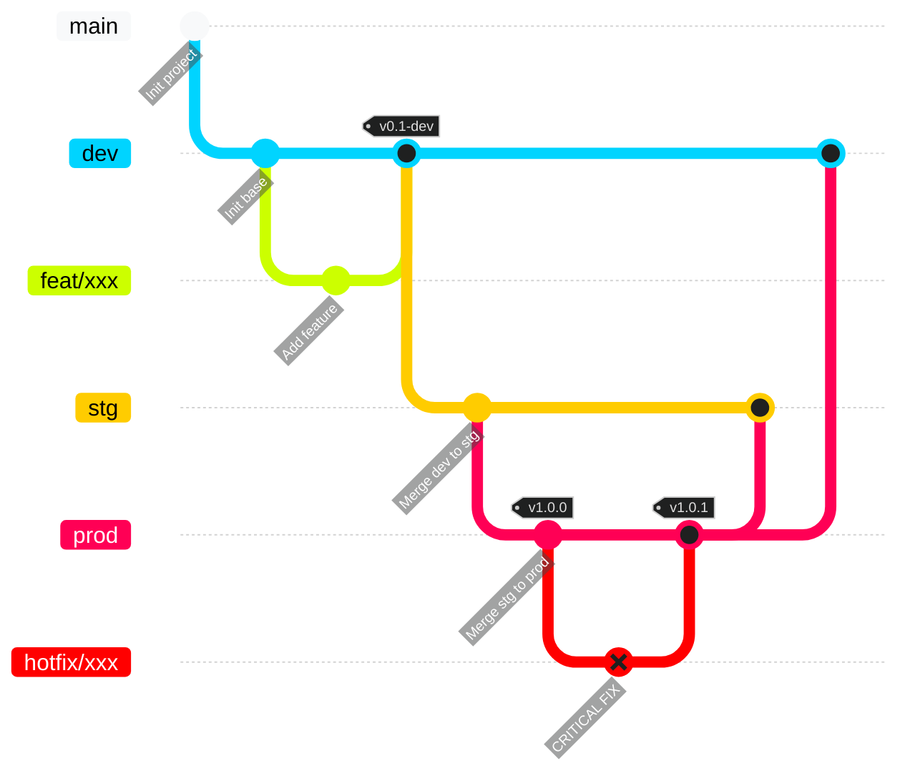
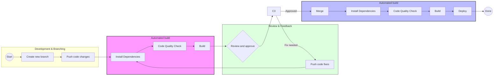
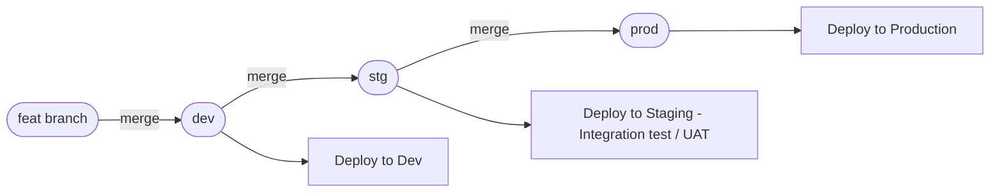

# Fitness CRM

A fitness CRM (Member Management) web application.

# Tech Stack

| Category       | Technology               | Notes                                                            |
| :------------- | :----------------------- | :--------------------------------------------------------------- |
| Runtime        | Node.js                  | v24 or higher recommended                                        |
| Language       | TypeScript               | Ensuring type safety throughout                                  |
| Framework      | Next.js                  | Using App Router                                                 |
| UI Library     | shadcn/ui                | Tailwind CSS-based components                                    |
| Linter         | ESLint                   | Automated code quality checks                                    |
| Formatter      | Prettier                 | Unified code style across the team <br> Automatic import sorting |
| Commit Control | husky <br /> lint-staged | Automatic Lint/Formatter execution on commit                     |

# Getting Started

## Installation

```bash
npm install
```

husky (Git hooks) will also be automatically set up during `npm install`.

## Environment Variables Setup

Copy the example environment file and update the values as needed:

```bash
cp .env.example .env
```

## Starting the Development Server

```bash
npm run dev
```

After starting, access [http://localhost:3000](http://localhost:3000).

## Linter / Formatter

The Linter and Formatter run automatically on commit.
To apply them to the entire project manually, run them as needed.

- ESLint
  - Config file: [eslint.config.mjs](./eslint.config.mjs)
  - Manual run: `npm run lint`
- Prettier
  - Config file: [prettier.config.mjs](./prettier.config.mjs)
  - Manual run: `npm run format`

# Codebase Overview

## 1. Folder Structure

```text
src/
├── app/                          # 【Routing & Domain Logic】
│   ├── (public)/                 # Public access (Login, Register, Forgot Password)
│   ├── (shared)/                 # Shared routes (home, about)
│   ├── (private)/                # Restricted access (Dashboard, Profile)
│   │   └── (dashboard)/          # Main application shell
│   │       ├── customers/        # Customer Domain
│   │       │   ├── _components/  # Local UI (CustomerTable, CustomerModal)
│   │       │   ├── _hooks/       # Local logic (useCustomerSort, useStats)
│   │       │   ├── _types/       # Local view models/interfaces
│   │       │   ├── actions.ts    # Server Actions
│   │       │   └── page.tsx      # Entry point for /customers
│   │       └── training/         # Training Domain
│   │           ├── _components/
│   │           └── page.tsx
│   ├── layout.tsx                # Global root layout
│   └── error.tsx                 # Global error boundary
├── components/                   # 【Shared UI Components】
│   ├── ui/                       # Primitive parts (@heroui/react)
│   └── layout/                   # Global structural (Sidebar, Navbar)
├── configs/                      # 【External Library Configs】
├── constants/                    # 【Global Constants】
├── hooks/                        # 【Global Shared Hooks】
├── lib/                          # 【Core Libraries & Auto-Gen】
│   ├── api/                      # Generated by @hey-api
│   ├── routes/                   # Type-safe navigation
│   └── utils.ts                  # Helper functions
├── providers/                    # 【Context & State Injection】
├── services/                     # 【Service Layer】
├── stores/                       # 【Global State Management】
├── styles/                       # 【Styling】 (TailwindCSS v4)
├── types/                        # 【Global Shared Types】
└── utils/                        # 【Helper Functions】
```

## 2. Operating Modes

- **`npm run dev`**: Start development mode with automatic route generation and file watching
- **`npm run build`**: Build the application (includes automatic route generation)
- **`npm run start`**: Start the production server
- **`npm run generate-routes`**: Manually generate routes configuration
- **`npm run generate-api`**: Generate API client from backend OpenAPI spec
- **`npm run generate-client`**: Generate API client from remote API endpoint

## 3. OpenAPI

- First, get familiar with the `hey-api` library being used ([documents](https://heyapi.dev/openapi-ts/get-started)).

- To generate API definition files from `hey-api`, we have two methods:
  - Use the command **`npm run generate-api`**: This command will call your backend server to connect to the `openapi.json` file.
  - Use the command **`npm run generate-client`**: Before using this, ensure that you have the **`openapi.json`** file saved in **`src/lib/`**. This command will take the schemas in the `openapi.json` file to generate API definition files.

- Usage:

```ts
const { data, error } = useQuery({
  ...getPetByIdOptions({
    path: {
      petId: 1,
    },
  }),
});

const { data, error } = useInfiniteQuery({
  ...getFooInfiniteOptions({
    path: {
      fooId: 1,
    },
  }),
  getNextPageParam: (lastPage, pages) => lastPage.nextCursor,
  initialPageParam: 0,
});

const addPet = useMutation({
  ...addPetMutation(),
});

addPet.mutate({
  body: {
    name: 'Kitty',
  },
});
```

## 4. Route Generation

This project uses an automatic route generation system that scans your app directory and creates type-safe route configurations. This eliminates the need for manual route definitions and provides full TypeScript support.

### Features

- **Type-Safe Navigation**: Full IntelliSense and compile-time checking
- **Auto-Detection**: Automatically detects pages in your app directory
- **Route Groups Support**: Supports Next.js route groups `(public)`, `(private)`, `(shared)`
- **Dynamic Routes**: Handles static, dynamic, and catch-all routes
- **Development Watching**: Automatically regenerates routes when you add/remove pages

### Route Groups

- **`(public)`**: Public routes accessible without authentication
- **`(private)`**: Private routes requiring authentication
- **`(shared)`**: Routes accessible in any authentication state

### Usage Example

```typescript
import { isPrivateRoute, navigate } from '@/lib/routes/routes.util';

// Type-safe navigation
const profileUrl = navigate('/profile'); // '/profile'
const isPrivate = isPrivateRoute('/profile'); // true
```

### Generated Files

The system generates 3 files in `src/lib/routes/`:

- `routes.config.ts`: Route configuration object
- `routes.type.ts`: TypeScript type definitions
- `routes.util.ts`: Utility functions for navigation

> 📖 **Detailed Documentation**: See [Route Generator README](src/lib/routes/README.md) for complete usage guide and API reference.

## 5. How to Declare a New Page

With the automatic route generation system, creating new pages is simplified. Just create the page file in the appropriate route group directory, and the routes will be automatically generated.

### Route Groups Structure

- **`(public)`**: For public pages (login, signup, landing pages)
- **`(private)`**: For authenticated user pages (dashboard, profile, settings)
- **`(shared)`**: For pages accessible in any authentication state (home, about)

### Steps to Create a New Page

1. **Choose the appropriate route group** based on authentication requirements:
   - Public routes → `src/app/(public)/`
   - Private routes → `src/app/(private)/`
   - Shared routes → `src/app/(shared)/`

2. **Create the page directory and file** following Next.js conventions:

   ```bash
   # For a private user profile page
   mkdir -p src/app/\(private\)/profile
   touch src/app/\(private\)/profile/page.tsx

   # For a public login page
   mkdir -p src/app/\(public\)/login
   touch src/app/\(public\)/login/page.tsx
   ```

3. **Implement your page component**:

   ```tsx
   // src/app/(private)/profile/page.tsx
   export default function ProfilePage() {
     return (
       <div>
         <h1>Profile Page</h1>
         {/* Your page content */}
       </div>
     );
   }
   ```

4. **Routes are automatically generated** - the system will detect your new page and update:
   - `src/lib/routes/routes.config.ts`
   - `src/lib/routes/routes.type.ts`
   - `src/lib/routes/routes.util.ts`

### Dynamic Routes

Create dynamic routes using Next.js standard patterns:

```bash
# Dynamic route: /users/[id]
mkdir -p src/app/\(private\)/users/[id]
touch src/app/\(private\)/users/[id]/page.tsx

# Catch-all route: /blog/[...slug]
mkdir -p src/app/\(shared\)/blog/[...slug]
touch src/app/\(shared\)/blog/[...slug]/page.tsx
```

### Navigation

Use the type-safe `navigate` function for programmatic navigation:

```typescript
import { navigate } from '@/lib/routes/routes.util';

// Static routes
const homeUrl = navigate('/'); // '/'

// Dynamic routes with parameters
const userUrl = navigate('/users/[id]', '123'); // '/users/123'

// In components with Next.js Link or router.push
<Link href={navigate('/profile')}>Profile</Link>
```

> **Note**: Routes are automatically regenerated when you start the dev server or run `npm run generate-routes`. No manual configuration needed!

# Git Flow



---

### 1. Environment Branches

| Branch | Purpose                               |
| ------ | ------------------------------------- |
| `dev`  | Development environment               |
| `stg`  | Testing environment before production |
| `prod` | Production environment                |

---

### 2. Environment Promotion Flow

Code is promoted through environments using Merge Requests.

```
dev → stg → prod
```

- devに反映
  - ローカルで動作確認
  - devに対するMR作成
- stgに反映
  - devで動作確認
  - 承認プロセス
  - dev→stgのMR作成
- prodに反映
  - stgで動作確認
  - 承認プロセス
  - stg→prodのMR作成

---

### 3. Development Flow

Feature development follows the steps below:

1. Create a new branch from `dev`
2. Implement the feature
3. Create a Merge Request (MR) to `dev`
4. CI pipeline runs automatically when the MR is created
5. After code review, merge into `dev`

Flow:

```
feat/* → dev
```

---

### 4. Branch Naming Convention

| Type     | Description           |
| -------- | --------------------- |
| `feat`   | New feature           |
| `fix`    | Bug fix               |
| `hotfix` | Urgent production fix |

Examples:

```
feat/member-search
fix/login-error
```

---

### 5. Commit Message Convention

| Type    | Description         |
| ------- | ------------------- |
| `feat`  | New feature         |
| `fix`   | Bug fix             |
| `test`  | Add or update tests |
| `chore` | Maintenance tasks   |

Examples:

```
feat: add member search feature
```

---

# CI/CD

CI pipeline runs automatically when a Merge Request is created or updated.

### 1. Pipeline Overview



### 2. Stages

| #   | Stage     | Step         | Command                      | Description                                          |
| --- | --------- | ------------ | ---------------------------- | ---------------------------------------------------- |
| 1   | **Build** | —            | `npm ci`                     | Install exact versions from `package-lock.json`      |
| 2   |           | Type Check   | `npx tsc --noEmit`           | Validate TypeScript types across the entire codebase |
| 2   |           | Lint         | `npm run lint`               | Run ESLint to check code quality                     |
| 2   |           | Format Check | `npx prettier --check ./src` | Verify code formatting with Prettier                 |
| 3   |           | —            | `npm run build`              | Generate routes and run Next.js production build     |

> All stages must pass before a Merge Request can be approved and merged.

---

# Release Flow

### 1. Overview

Release flow describes the process of promoting code changes from development to production through controlled environments.

The system uses a **multi-environment promotion model**:

```
Development → Staging → Production
```

Code changes are gradually promoted through each environment to ensure stability and quality before reaching production.

---

### 2. Release Flow Diagram



---

### 3. Release Versioning

Each production release should be tagged using semantic versioning:

```
MAJOR.MINOR.PATCH
```

Example:

```
v1.0.0
v1.1.0
v1.1.1
```

Tag example:

```bash
git tag v1.2.0
git push origin v1.2.0
```

---

### 4. Release Checklist

Before releasing to production:

- [ ] Code review approved
- [ ] CI pipeline passed
- [ ] QA testing completed
- [ ] No critical issues remaining
- [ ] Rollback plan prepared

---

### 5. Rollback Strategy

If issues occur after deployment:

1. Identify the last stable version
2. Roll back the deployment to the previous version
3. Investigate the root cause
4. Create a hotfix if necessary
