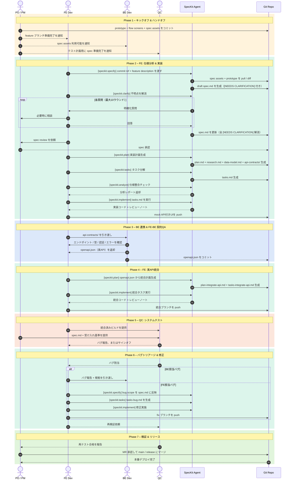

# SDD シーケンスフロー

> **SpecKit** AIエージェントを使ったエンドツーエンドの開発フロー。  
> 役割: PO/PM · FE Dev · BE Dev · QC · SpecKit Agent · Git Repo

---

## フロー概要

```
Phase 1 – キックオフ & ハンドオフ
    ↓ feature ブランチ + prototype + spec assets をコミット
Phase 2 – FE: 仕様分析 & 実装 [speckit.specify → speckit.clarify → speckit.plan → speckit.tasks → speckit.analyze → speckit.implement]
    ↓ spec.md + plan.md + tasks.md + mock API付きUI
Phase 3 – BE 連携 & FE-BE 契約QA
    ↓ openapi.json（確定）
Phase 4 – FE: 実API統合 [speckit.plan → speckit.implement]
    ↓ 統合済みブランチ
Phase 5 – QC: システムテスト
    ↓ サインオフ or バグレポート
Phase 6 – バグトリアージ & 修正 [speckit.specify → speckit.tasks → speckit.implement]
    ↓ fix ブランチ
Phase 7 – 検証 & リリース
    ↓ 本番デプロイ
```

---

## シーケンス図



---

## Review Gates

| Gate                          | Phase   | 条件                                         | オーナー     |
| ----------------------------- | ------- | -------------------------------------------- | ------------ |
| ★ Gate 1 – Spec Approved      | Phase 2 | 全 `[NEEDS CLARIFICATION]` 解消 + PO/PM 承認 | PO / PM      |
| ★ Gate 2 – Contract Finalized | Phase 3 | 契約確認完了 + `openapi.json` コミット       | FE + BE + PO |
| ★ Gate 3 – QC Sign-off        | Phase 5 | テストケース全通過                           | QC → PO      |
| ★ Gate 4 – MR Approved        | Phase 7 | 再テスト合格 + MR 承認                       | PO / PM      |
