# SDD Sequence Flow

> End-to-end development flow using **SpecKit** AI agents.
> Roles: PO/PM · FE Dev · BE Dev · QC · SpecKit Agent · Git Repo

---

## Flow Overview

```
Phase 1 – Kickoff & Handoff
    ↓ feature branch + prototype + spec assets committed
Phase 2 – FE: Spec Analysis & Implementation  [speckit.specify → speckit.clarify → speckit.plan → speckit.tasks → speckit.analyze → speckit.implement]
    ↓ spec.md + plan.md + tasks.md + UI with mock API
Phase 3 – BE Integration & FE–BE Contract QA
    ↓ openapi.json (finalized)
Phase 4 – FE: Real API Integration  [speckit.plan → speckit.implement]
    ↓ integrated branch
Phase 5 – QC: System Testing
    ↓ sign-off or bug report
Phase 6 – Bug Triage & Fix  [speckit.specify → speckit.tasks → speckit.implement]
    ↓ fix branch
Phase 7 – Verification & Release
    ↓ deployed to production
```

---

## Sequence Diagram

```mermaid
sequenceDiagram
    autonumber
    actor PO as PO / PM
    actor FE as FE Dev
    actor BE as BE Dev
    actor QC as QC
    participant SK as SpecKit Agent
    participant GIT as Git Repo

    %% ==========================================
    %% Phase 1 – Kickoff & Handoff
    %% ==========================================
    rect rgb(250, 248, 244)
        Note over PO,GIT: Phase 1 – Kickoff & Handoff

        PO->>GIT: Commit prototype + flow screens + spec assets (Markdown)
        PO-->>FE: Notify: feature branch ready
        PO-->>BE: Notify: spec assets available
        PO-->>QC: Notify: spec ready for test planning
    end

    %% ==========================================
    %% Phase 2 – FE: Spec Analysis & Implementation
    %% ==========================================
    rect rgb(250, 248, 244)
        Note over PO,GIT: Phase 2 – FE: Spec Analysis & Implementation

        Note right of FE: Skill: speckit.specify
        FE->>SK: [speckit.specify] With commit ref + feature description
        SK->>GIT: Pull & diff spec assets + prototype
        GIT-->>SK: Raw diff output
        SK->>GIT: Generate draft spec.md (with [NEEDS CLARIFICATION] tags)

        Note over SK,FE: Clarification Round — speckit.clarify
        Note right of FE: Skill: speckit.clarify
        FE->>SK: [speckit.clarify] Trigger clarification skill on draft spec.md
        loop Each question (max 10 rounds)
            SK->>FE: [speckit.clarify] e.g. What is the behavior when the API returns an empty list? (A) Show empty state with placeholder (B) Hide section entirely (C) Show skeleton loader
            FE->>PO: (Consult PO/BA if necessary)
            FE-->>SK: Answer
        end
        SK->>GIT: Update docs/spec/<feature>/spec.md ( all [NEEDS CLARIFICATION] resolved)
        %% Note over FE,PO: Dev → PO/PM Escalation
        %% FE->>PO: Escalate unresolved items outside Dev authority
        %% PO-->>FE: Decision / spec update
        %% FE->>SK: Feed PO decisions → finalize spec.md
        %% SK->>GIT: Update docs/spec/<feature>/spec.md (finalized — all [NEEDS CLARIFICATION] resolved)

        Note over FE,PO: PO/PM Spec Review & Approval
        FE->>PO: Request Spec Review
        PO-->>GIT: Approved — spec.md sign-off confirmed
        Note right of GIT: All [Pending] resolved → Spec approved

        %% PO->>PO: Review spec.md (completeness, correctness, alignment)
        %% alt Spec needs revision
        %%     PO-->>FE: Feedback / change requests
        %%     FE->>SK: Apply PO feedback → revise spec.md
        %%     SK->>GIT: Update docs/spec/<feature>/spec.md (revised)
        %%     FE->>PO: Re-submit revised spec.md
        %% end
        %% PO-->>FE: Approved — spec.md sign-off confirmed
        %% SK->>GIT: Tag spec.md as approved (status: approved)

        Note right of FE: Skill: speckit.plan
        FE->>SK: [speckit.plan] Generate implementation plan from spec.md
        SK->>GIT: Generate docs/spec/<feature>/plan.md + research.md + data-model.md + api-contracts/



        Note right of FE: Skill: speckit.plan
        FE->>SK: [speckit.plan] Generate implementation plan from spec.md
        SK->>GIT: Generate docs/spec/<feature>/plan.md + research.md + data-model.md + api-contracts/

        Note right of FE: Skill: speckit.tasks
        FE->>SK: [speckit.tasks] Break down plan into task list
        SK->>GIT: Generate docs/spec/<feature>/tasks.md (user stories + steps + priority order)

        Note right of FE: Skill: speckit.analyze
        FE->>SK: [speckit.analyze] Cross-artifact consistency check (spec / plan / tasks)
        SK-->>FE: Analysis report (inconsistencies / gaps / conflicts)

        alt Issues found (CRITICAL or HIGH)
            FE->>SK: Apply approved remediations → update affected artifacts
            SK->>GIT: Generate updated artifacts (overwrite affected docs)
        end

        Note right of FE: Skill: speckit.implement
        FE->>SK: [speckit.implement] Execute tasks.md with full context
        SK-->>FE: Code output + inline review notes

        FE->>FE: Manual QA checklist + code review
        FE->>GIT: Push branch – UI with mock API (commit refs spec + tasks)
    end

    %% ==========================================
    %% Phase 3 – BE Integration & FE–BE Contract QA
    %% ==========================================
    rect rgb(250, 248, 244)
        Note over PO,GIT: Phase 3 – BE Integration & FE–BE Contract QA

        FE->>BE: Handoff: api-contracts/ (mock API docs + data model)

        Note over FE,BE: Contract Review Round
        BE->>FE: Clarify: endpoints / fields / data types / auth flow / error codes
        FE-->>BE: Response: clarification + contract update if needed

        Note over FE,PO: FE–BE → PO/PM Escalation (if contract-impacting)
        FE->>PO: Escalate: contract change requires spec decision
        PO-->>FE: Decision / updated spec
        FE-->>BE: Relay: PO decision → finalized contract

        BE-->>FE: Output: openapi.json (real API implemented)
        BE-->>GIT: Commit openapi.json
    end

    %% ==========================================
    %% Phase 4 – FE: Real API Integration
    %% ==========================================
    rect rgb(250, 248, 244)
        Note over PO,GIT: Phase 4 – FE: Real API Integration

        Note right of FE: Skill: speckit.plan
        FE->>SK: [speckit.plan] Feed openapi.json → generate integration plan
        SK->>GIT: Commit docs/spec/<feature>/plan-integrate-api.md + tasks-integrate-api.md

        Note right of FE: Skill: speckit.implement
        FE->>SK: [speckit.implement] Execute tasks-integrate-api.md
        SK-->>FE: Integrated code + review notes

        FE->>FE: Verify loading / error / empty / success states
        FE->>GIT: Push integrated branch (remove temp plan & task files)
    end

    %% ==========================================
    %% Phase 5 – QC: System Testing
    %% ==========================================
    rect rgb(250, 248, 244)
        Note over PO,GIT: Phase 5 – QC: System Testing

        FE->>QC: Input: test build (integrated branch)
        PO->>QC: Input: spec.md + acceptance criteria

        alt Defects Found
            QC-->>FE: Output: bug report + evidence (screenshot / video / Notion)
        else All Passed
            QC-->>PO: Output: sign-off
        end
    end

    %% ==========================================
    %% Phase 6 – Bug Triage & Fix
    %% ==========================================
    rect rgb(250, 248, 244)
        Note over PO,GIT: Phase 6 – Bug Triage & Fix

        Note over FE,QC: Triage – Identify Bug Ownership
        FE->>QC: Request: reproduction steps / additional evidence
        QC-->>FE: Response: confirmed steps + supplemental evidence
        FE->>FE: Triage: determine bug scope (FE / BE / shared)

        alt Bug owned by BE
            FE->>BE: Handoff: bug report + evidence + affected endpoint
            BE-->>FE: Output: fix deployed / updated openapi.json if needed
        else Bug owned by FE
            Note right of FE: Skill: speckit.specify
            FE->>SK: [speckit.specify] Feed bug report → review & update spec.md
            SK->>GIT: Commit docs/spec/<feature>/spec.md (updated – bug scope identified)

            Note over FE,PO: Dev → PO/PM Escalation (if spec-impacting)
            FE->>PO: Report: bug requires spec change
            PO-->>FE: Decision: approved fix direction

            Note right of FE: Skill: speckit.tasks
            FE->>SK: [speckit.tasks] Generate tasks-bug.md from updated spec
            SK->>GIT: Commit docs/spec/<feature>/tasks-bug.md

            Note right of FE: Skill: speckit.implement
            FE->>SK: [speckit.implement] Execute tasks-bug.md with full context
            SK-->>FE: Fixed code + review notes

            FE->>GIT: Push fix branch (commit refs bug ID + spec)
        end

        FE-->>QC: Notify: fix deployed – ready for re-verification
    end

    %% ==========================================
    %% Phase 7 – Verification & Release
    %% ==========================================
    rect rgb(250, 248, 244)
        Note over PO,GIT: Phase 7 – Verification & Release

        QC-->>PO: Output: re-test passed / sign-off confirmed
        PO->>GIT: Approve MR → merge to main / release branch
        GIT-->>PO: Deployed to production
    end
```



---

## SpecKit Agent Reference

| Phase               | Skill invoked       | Output                                                         |
| ------------------- | ------------------- | -------------------------------------------------------------- |
| Phase 2 – Spec      | `speckit.specify`   | `spec.md` (draft)                                              |
| Phase 2 – Clarify   | `speckit.clarify`   | `spec.md` (finalized)                                          |
| Phase 2 – Plan      | `speckit.plan`      | `plan.md` · `research.md` · `data-model.md` · `api-contracts/` |
| Phase 2 – Tasks     | `speckit.tasks`     | `tasks.md`                                                     |
| Phase 2 – Analyze   | `speckit.analyze`   | Analysis report (read-only)                                    |
| Phase 2 – Implement | `speckit.implement` | Code + inline review notes                                     |
| Phase 4 – Plan      | `speckit.plan`      | `plan-integrate-api.md` · `tasks-integrate-api.md`             |
| Phase 4 – Implement | `speckit.implement` | Integrated code                                                |
| Phase 6 – Specify   | `speckit.specify`   | `spec.md` (bug scope update)                                   |
| Phase 6 – Tasks     | `speckit.tasks`     | `tasks-bug.md`                                                 |
| Phase 6 – Implement | `speckit.implement` | Fixed code                                                     |

---

## Review Gates

| Gate                          | Phase   | Trigger                                                 | Owner   |
| ----------------------------- | ------- | ------------------------------------------------------- | ------- |
| ★ Gate 1 – Spec Approved      | Phase 2 | All `[NEEDS CLARIFICATION]` resolved, spec.md committed | PO / BA |
| ★ Gate 2 – Contract Finalized | Phase 3 | openapi.json committed, PO decisions relayed            | FE + BE |
| ★ Gate 3 – QC Sign-off        | Phase 5 | All test cases passed                                   | QC → PO |
| ★ Gate 4 – MR Approved        | Phase 7 | MR reviewed and merged                                  | PO / PM |
