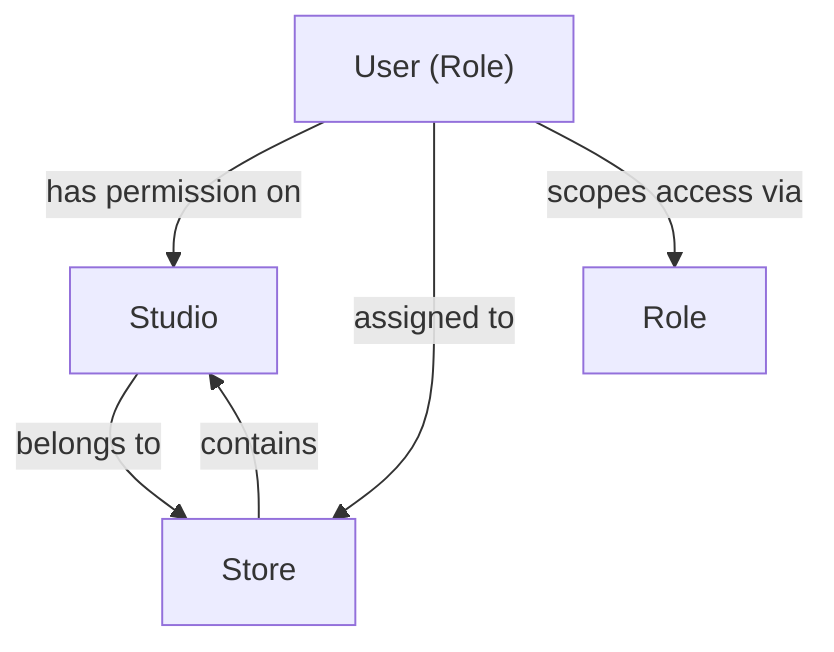

# Data Model: D-03 Studio Management — FR-001 Studio List Display

**Scope**: Entities and validation rules required for studio list functionality.

---

## Entity: Studio

**Purpose**: Core domain entity representing a physical studio/room within a store.

**Fields**:

| Field             | Type                 | Required | Validation                                                           | Notes                                                    |
| ----------------- | -------------------- | -------- | -------------------------------------------------------------------- | -------------------------------------------------------- |
| `id`              | string (UUID)        | ✅       | Non-empty                                                            | Unique identifier; displayed to user                     |
| `name`            | string               | ✅       | Min 1, max 100 chars; no leading/trailing spaces                     | User-readable display name (e.g., "スタジオA")           |
| `store_id`        | string (UUID)        | ✅       | Foreign key → Store.id                                               | Studio belongs to exactly one store                      |
| `store_name`      | string               | ✅       | Derived from Store.name                                              | Denormalized for list display                            |
| `studio_type`     | enum                 | ✅       | One of: `studio-lesson`, `pt`, `body-care`                           | Typed studio space (区分)                                |
| `capacity`        | integer              | ✅       | Min 1, max 1000                                                      | Maximum occupancy                                        |
| `available_hours` | string               | ✅       | Format: "HH:MM–HH:MM" or comma-separated ranges                      | Display only; e.g., "10:00–21:00"                        |
| `brand`           | enum                 | ✅       | One of: `JOYFIT`, `JOYFIT24`, `JOYFIT_YOGA`, `JOYFIT_PLUS`, `FIT365` | Brand association                                        |
| `status`          | enum                 | ✅       | One of: `active`, `inactive`                                         | Determines visual badge; filters default to showing both |
| `remarks`         | string               | ❌       | Max 500 chars                                                        | Internal notes (not displayed in list)                   |
| `equipment_notes` | string               | ❌       | Max 500 chars                                                        | Equipment description (not displayed in list)            |
| `created_at`      | timestamp (ISO 8601) | ✅       | RFC 3339                                                             | System-managed                                           |
| `updated_at`      | timestamp (ISO 8601) | ✅       | RFC 3339                                                             | System-managed                                           |

---

## Entity: Store

**Purpose**: Administrative parent entity for studios and other resources.

**Fields** (subset for studio list context):

| Field    | Type          | Required | Notes                                                                |
| -------- | ------------- | -------- | -------------------------------------------------------------------- |
| `id`     | string (UUID) | ✅       |                                                                      |
| `name`   | string        | ✅       | Store display name (e.g., "渋谷店")                                  |
| `brand`  | enum          | ✅       | One of: `JOYFIT`, `JOYFIT24`, `JOYFIT_YOGA`, `JOYFIT_PLUS`, `FIT365` |
| `status` | enum          | ✅       | One of: `active`, `inactive`                                         |

---

## Entity: Role & Data Scope

**Purpose**: Determines which studios a user can view and which actions they can perform.

**Scoping Rules** (from FR-001-08):

| Role        | Data Scope                                 | View Permission  | Edit Permission  | Delete Permission  |
| ----------- | ------------------------------------------ | ---------------- | ---------------- | ------------------ |
| System      | All studios across all stores              | ✅ View all      | ✅ Edit all      | ✅ Delete all      |
| Headquarter | All studios across all stores              | ✅ View all      | ✅ Edit all      | ✅ Delete all      |
| Manager     | Studios in assigned stores only            | ✅ View assigned | ✅ Edit assigned | ✅ Delete assigned |
| Staff       | Studios in single assigned store only      | ✅ View assigned | ✅ Edit assigned | ❌ Cannot delete   |
| Trainer     | Studios in assigned store only (read-only) | ✅ View assigned | ❌ Cannot edit   | ❌ Cannot delete   |
| Observer    | Studios in assigned store only (read-only) | ✅ View assigned | ❌ Cannot edit   | ❌ Cannot delete   |

**Implementation**: Scoping enforced in mock route handler (`src/app/api/crm/studios/route.ts`) at API boundary. Client-side permission checks on action buttons via `useAuth()` hook.

---

## API Response: StudioListResponse

**Purpose**: Paginated list of studios matching search/filter/sort criteria.

```typescript
interface StudioListItem {
  id: string;
  name: string;
  store_id: string;
  store_name: string;
  studio_type: 'studio-lesson' | 'pt' | 'body-care';
  capacity: number;
  available_hours: string;
  brand: 'JOYFIT' | 'JOYFIT24' | 'JOYFIT_YOGA' | 'JOYFIT_PLUS' | 'FIT365';
  status: 'active' | 'inactive';
}

interface StudioListResponse {
  items: StudioListItem[];
  total: number;
  page: number;
  limit: number;
  has_next: boolean;
}
```

---

## Query Parameters: GetStudiosQuery

**Purpose**: Filters, search, sort, and pagination for studio list API.

```typescript
interface GetStudiosQuery {
  // Pagination
  page?: number; // Default: 1
  limit?: number; // One of: 25, 50 (default), 100, 200

  // Search
  search?: string; // Case-insensitive partial match on studio name

  // Filters
  store_id?: string; // Single-select filter (pre-scoped to user)
  studio_type?: string; // Single-select filter
  brand?: string; // Single-select filter
  status?: 'active' | 'inactive'; // Single-select or empty (shows both)

  // Sort
  sort_by?: 'id' | 'name' | 'store_name' | 'studio_type' | 'capacity';
  sort_order?: 'asc' | 'desc'; // Default: 'asc'
}
```

---

## Validation Rules

### Studio Type Enum

```typescript
type StudioType = 'studio-lesson' | 'pt' | 'body-care';

const STUDIO_TYPE_LABELS: Record<StudioType, string> = {
  'studio-lesson': 'スタジオレッスン用',
  pt: 'PT用',
  'body-care': 'ボディケア用',
};
```

### Brand Enum

```typescript
type Brand = 'JOYFIT' | 'JOYFIT24' | 'JOYFIT_YOGA' | 'JOYFIT_PLUS' | 'FIT365';

const BRAND_LABELS: Record<Brand, string> = {
  JOYFIT: 'JOYFIT',
  JOYFIT24: 'JOYFIT24',
  JOYFIT_YOGA: 'JOYFIT YOGA',
  JOYFIT_PLUS: 'JOYFIT+',
  FIT365: 'FIT365',
};
```

### Status Enum

```typescript
type StudioStatus = 'active' | 'inactive';

const STATUS_LABELS: Record<StudioStatus, string> = {
  active: '有効',
  inactive: '無効',
};

const STATUS_BADGE_VARIANTS: Record<StudioStatus, string> = {
  active: 'bg-success/10 text-success border-success/30', // Green
  inactive: 'bg-muted text-muted-foreground border-border', // Gray
};
```

---

## Constraints & Business Rules

### Role-Based Actions (from FR-001-10)

- **View Detail**: All roles
- **Edit**: System, Headquarter, Manager, Staff (❌ Trainer, Observer)
- **Delete**: System, Headquarter, Manager only (❌ Staff, Trainer, Observer)

### Filter Scope Pre-filtering

- **Store filter options** are pre-scoped to user's accessible stores (assumption from spec)
- A Staff user only sees their own store in the Store filter dropdown
- A Manager sees only their assigned stores
- System/Headquarter see all stores

### Default Behavior

- **Initial sort**: Studio ID ascending (FR-001-04, AS-003)
- **Default status filter**: Empty (shows both active and inactive)
- **Search case-insensitivity**: `name.toLowerCase().includes(search.toLowerCase())`
- **Pagination default**: 50 items per page

---

## Relationships & Dependencies



---

## Phase 1 Mock Data Requirements

**Minimum seed data** (to test all 6 roles and filters):

- **Stores**: ≥ 3 (e.g., Shibuya, Shinjuku, Ikebukuro)
- **Studios per store**: ≥ 3
- **Studio types**: All 3 types (`studio-lesson`, `pt`, `body-care`) represented
- **Brands**: At least 2 brands represented
- **Statuses**: Both active and inactive studios
- **Total**: ≥ 9 studios across stores

**Example distribution**:

```
Shibuya (JOYFIT)
  ├─ Studio A (studio-lesson, JOYFIT, active)
  ├─ Studio B (pt, JOYFIT, active)
  └─ Studio C (body-care, JOYFIT, inactive)

Shinjuku (FIT365)
  ├─ Studio D (studio-lesson, FIT365, active)
  ├─ Studio E (studio-lesson, FIT365, active)
  └─ Studio F (pt, FIT365, inactive)

Ikebukuro (JOYFIT24)
  ├─ Studio G (studio-lesson, JOYFIT24, active)
  ├─ Studio H (body-care, JOYFIT24, active)
  └─ Studio I (pt, JOYFIT24, active)
```

---

## State Transitions

Studio states (not yet designed, but noted for FR-005):

- `active` → `inactive` (deactivation via delete flow)
- `inactive` → `active` (reactivation, not in FR-001 scope)

---

## Next Phase Notes

- **FR-002 (Registration Form)**: Will require `CreateStudioSchema` with `POST /crm/studios`
- **FR-003 (Detail View)**: Will require `GET /crm/studios/{id}` returning full `StudioDetail`
- **FR-004 (Edit Form)**: Will require `PUT /crm/studios/{id}` with `UpdateStudioSchema`
- **FR-005 (Delete/Deactivation)**: Will require soft-delete or status change logic
